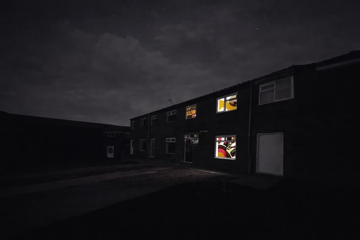

 
  

## Aqui eu manjo

## Aprendendno

* Desenvolvimento Web
* Banco de Dados
* C#
* JavaScript

## Projetos em destaque

### 💬 EmotiHub

Projeto desenvolvido para facilitar o contato entre pessoas e profissionais da área de psicologia, utilizando uma plataforma web.

## Gostos

Tetris, Persona e Bangers 👍

 

